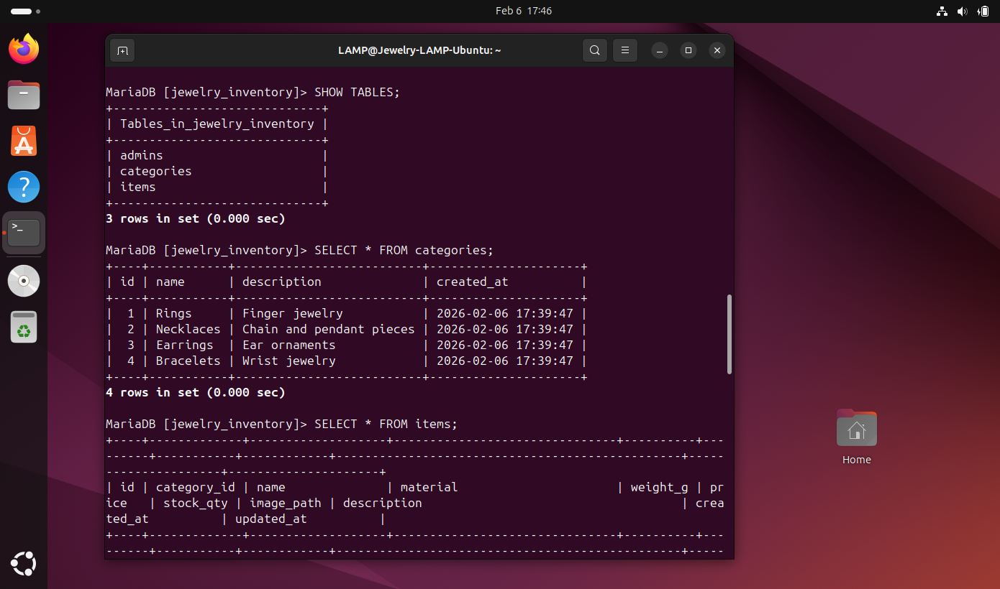
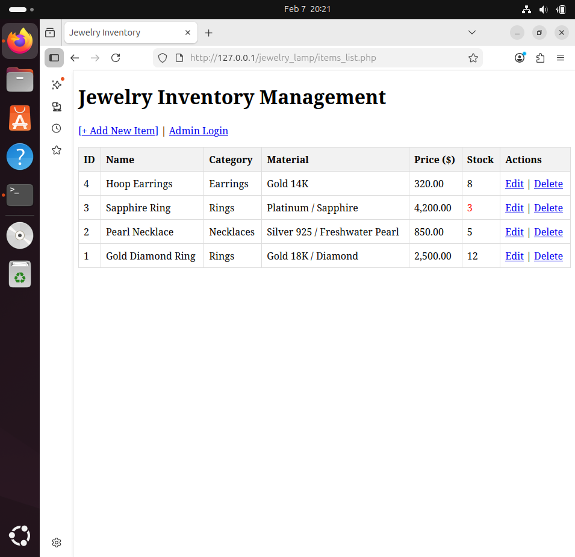

# Jewelry Inventory Manager

A single-user jewelry inventory management web application built with the LAMP stack on Ubuntu in Oracle VirtualBox.

## Overview

Jewelry Inventory Manager is a local web application designed to demonstrate full-stack development and systems administration skills. The project includes database-driven inventory management, secure admin access, image handling, search and filtering, CSV export, and HTTPS setup in a lab environment.

## Features

- Admin authentication.
- CRUD operations for jewelry items.
- Image upload support.
- Search and filtering.
- Pagination.
- CSV export.
- HTTPS enabled in a local lab environment.

## Tech Stack

- Ubuntu
- Apache
- PHP
- MariaDB
- HTML / CSS
- VirtualBox

## Project Breakdown

**Environment setup:**
The application was deployed on Ubuntu 24.04.3 in Oracle VirtualBox with allocated resources for local testing and development. 
Apache, PHP, and MariaDB were installed and configured to form a working LAMP environment

**Database integration:**
MariaDB was used as the database layer for compatibility with MySQL workflows. 
The application connects to the database through PHP and retrieves joined data from related tables such as items and categories.

**Application features:**
The project includes create, read, update, and delete functionality for jewelry items, along with inventory search and filtering. 
It also supports CSV export, admin authentication, and image uploads for item records.

**Security and deployment:**
The setup includes basic hardening steps such as configuring HTTPS with a self-signed certificate for local secure access. 
Admin-only actions are protected behind authentication.

## Screenshots

<table>
  <tr>
    <td align="center"><strong>DB data test</strong></td>
    <td align="center"><strong>Inventory test list</strong></td>
  </tr>
  <tr>
    <td></td>
    <td></td>
  </tr>

  <tr>
    <td align="center"><strong>Admin login</strong></td>
    <td align="center"><strong>Add Item</strong></td>
  </tr>
  <tr>
    <td></td>
    <td></td>
  </tr>

  <tr>
    <td align="center"><strong>Edit Item</strong></td>
    <td align="center"><strong>Inventory List</strong></td>
  </tr>
  <tr>
    <td></td>
    <td></td>
  </tr>
</table>

## Setup

1. Provision an Ubuntu 24.04 virtual machine in Oracle VirtualBox.
2. Install and validate Apache, PHP, and MariaDB.
3. Secure the MariaDB installation and create the project database.
4. Import the schema and sample inventory data.
5. Verify PHP-to-MariaDB connectivity.
6. Implement and test the application workflow, including login, CRUD operations, filtering, CSV export, and image upload.
7. Configure HTTPS locally with a self-signed certificate.

## Security Notes

Sensitive information, such as database passwords, API credentials, and environment-specific configuration details, must never be committed to version control. In a production environment, ensure these values are stored securely using environment variables or a dedicated secret management service (e.g., HashiCorp Vault, AWS Secrets Manager, or GitHub Secrets).

## What I Learned

This project reinforced my experience in:
- Linux server setup and local application deployment.
- Apache and PHP configuration in a LAMP environment.
- MariaDB database design, connectivity, and data handling.
- Troubleshooting web, database, and file-related issues during development.
- Implementing operational features such as authentication, logging, search, filtering, and exports.
- Applying security-minded practices in a local lab environment.
- Structuring a full-stack project in a way that demonstrates production-style thinking.

## Why This Project

I chose to build this project to explore new concepts within the field I am currently learning and working in, while challenging myself to design, troubleshoot, and solve problems creatively to reach the best possible outcome.

My purpose was not to specialize in full-stack development or focus on a single programming language; rather, it was to strengthen my understanding of the underlying system architecture. This included deep-diving into Linux, database connectivity, Apache, and other core infrastructure components to better understand how these technologies integrate to form a functional environment.

From a practical perspective, a web-based inventory management system addresses a fundamental, real-world need for entrepreneurs and small business owners starting their journey. By building this solution, I aimed to demonstrate the value a technical professional delivers by creating systems that are both highly functional and relevant in real-world environments.
