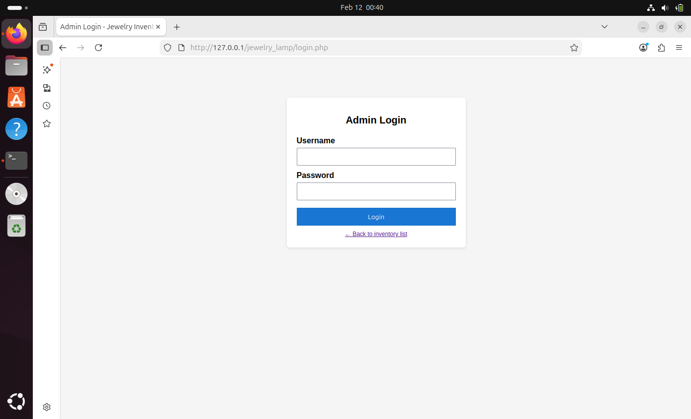
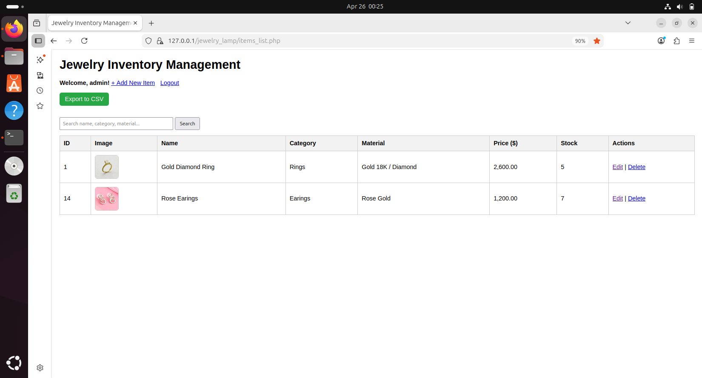
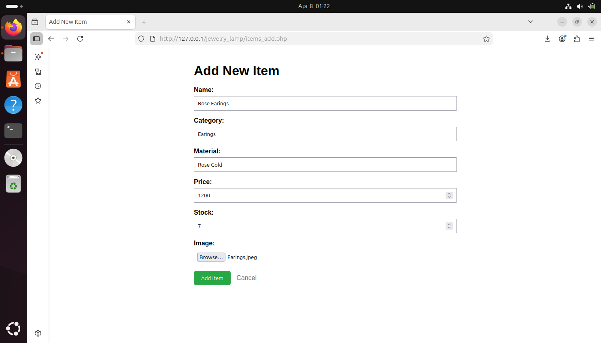
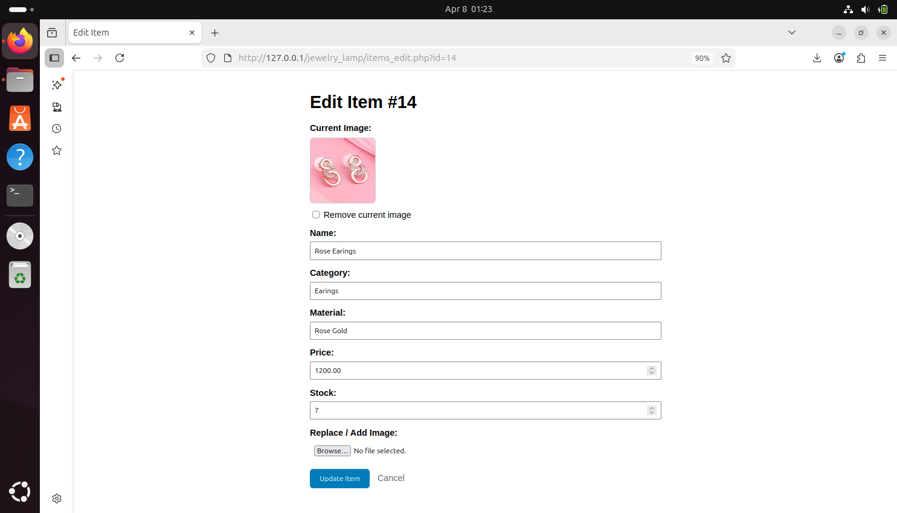
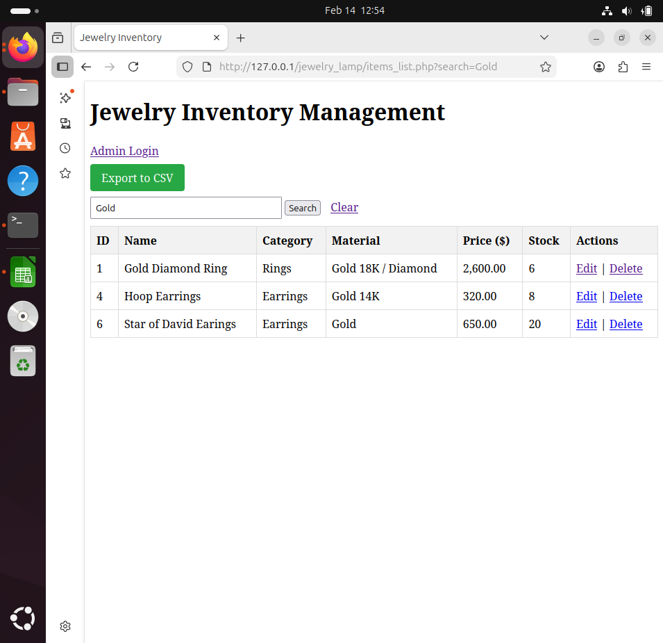
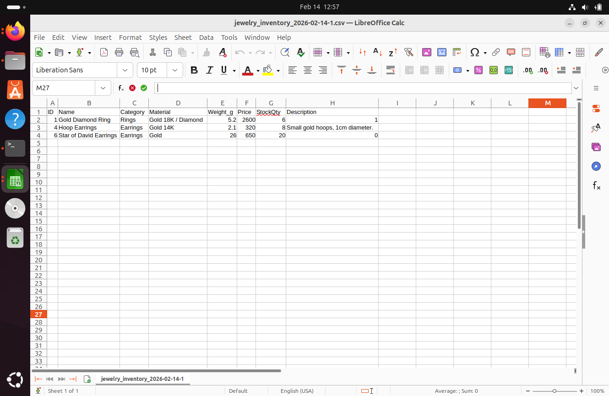

# Jewelry Inventory Manager

A single-user jewelry inventory management web application built with the LAMP stack (Linux, Apache, MariaDB/, PHP) on Ubuntu.

## Overview

Jewelry Inventory Manager is a single-user web application built with the LAMP stack on Ubuntu (Oracle VirtualBox). 
It demonstrates practical full-stack development and systems administration skills through CRUD operations, search and filtering, CSV export, image uploads, admin authentication, and HTTPS configuration.

## Features

- Admin authentication
- Create, read, update, and delete (CRUD) jewelry items
- Image upload support
- Search and filtering
- Pagination
- CSV export
- HTTPS enabled in a local lab environment

## Tech Stack

- Ubuntu
- Apache
- PHP
- MariaDB
- HTML / CSS
- VirtualBox

## Project Breakdown

Environment setup:
The application was deployed on Ubuntu 24.04.3 in Oracle VirtualBox with allocated resources for local testing and development. 
Apache, PHP, and MariaDB were installed and configured to form a working LAMP environment

Database integration:
MariaDB was used as the database layer for compatibility with MySQL workflows. 
The application connects to the database through PHP and retrieves joined data from related tables such as items and categories.

Application features:
The project includes create, read, update, and delete functionality for jewelry items, along with inventory search and filtering. 
It also supports CSV export, admin authentication, and image uploads for item records.

Security and deployment:
The setup includes basic hardening steps such as configuring HTTPS with a self-signed certificate for local secure access. 
Admin-only actions are protected behind authentication.

## Screenshots
## Screenshots

<table>
  <tr>
    <td align="center"><strong>Login Form</strong></td>
    <td align="center"><strong>Inventory List</strong></td>
  </tr>
  <tr>
    <td></td>
    <td></td>
  </tr>

  <tr>
    <td align="center"><strong>Add Item</strong></td>
    <td align="center"><strong>Edit Item</strong></td>
  </tr>
  <tr>
    <td></td>
    <td></td>
  </tr>

  <tr>
    <td align="center"><strong>Filtering</strong></td>
    <td align="center"><strong>CSV Export</strong></td>
  </tr>
  <tr>
    <td></td>
    <td></td>
  </tr>
</table>

## Setup

1. Create an Ubuntu virtual machine in Oracle VirtualBox.
2. Allocate resources similar to the original lab setup, such as 4 GB RAM, 2 CPUs, and a dynamically allocated virtual disk.
3. Install Ubuntu and verify that the VM is running correctly.
4. Install and start Apache, then confirm that the default Apache page is being served.
5. Install PHP and confirm that Apache can process PHP files.
6. Install MariaDB, secure the installation, and create a dedicated database and application user.
7. Place the project files in the Apache web root directory.
8. Import the project database schema and sample data into MariaDB.
9. Update the application database configuration file with your own local database values.
10. Verify that the PHP application can connect to MariaDB and retrieve data correctly.
11. Test the main application flows, including login, CRUD operations, filtering, CSV export, and image upload.
12. Optionally configure HTTPS with a self-signed certificate for local secure access.

## Security Notes

Sensitive values such as passwords, credentials, and local-only configuration details are not included in this repository.  
Use your own local configuration when testing the project.

## What I Learned

This project helped strengthen my skills in:
- LAMP stack deployment
- PHP and MariaDB integration
- CRUD application design
- File uploads and form handling
- Local HTTPS configuration
- Technical troubleshooting and debugging

## Status

Completed and documented as a portfolio project.
